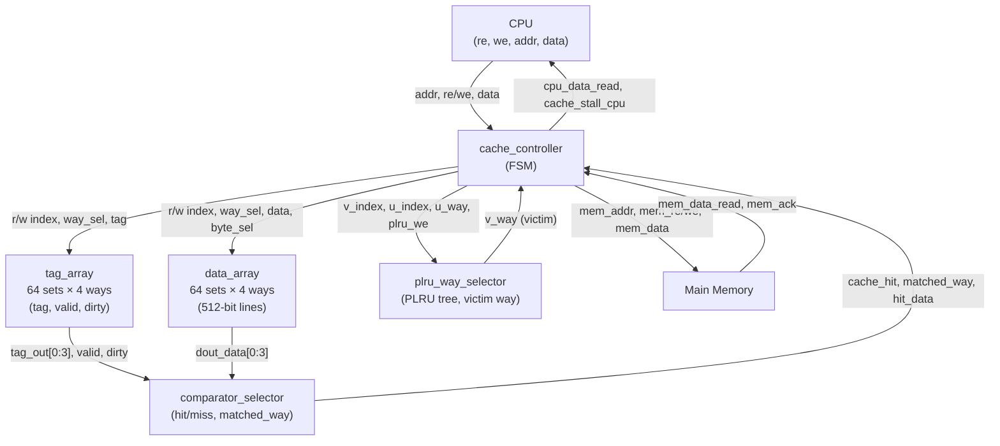

# 4-Way Set-Associative Cache Controller

A synthesizable SystemVerilog implementation of a 4-way set-associative cache with write-back/write-allocate policy and Pseudo-LRU (PLRU) replacement.

## Cache Architecture

| Parameter        | Value                          |
|-----------------|-------------------------------|
| Associativity   | 4-way set-associative          |
| Number of Sets  | 64 (6-bit index)               |
| Cache Line Size | 512 bits (64 bytes)            |
| Tag Width       | 20 bits                        |
| Address Width   | 32 bits                        |
| Write Policy    | Write-back, Write-allocate     |
| Replacement     | Pseudo-LRU (PLRU tree)         |

## Module Overview

The design is split into the following submodules, all orchestrated by `cache_controller`:

- **`cache_controller`** — Top-level FSM controller; manages read/write pipelines, stall signals, and coordinates all submodules
- **`tag_array`** — Stores tag, valid, and dirty bits for all 64 sets × 4 ways; supports simultaneous read (combinational) and write (sequential)
- **`data_array`** — Stores 512-bit cache lines with byte-level write masking via a 64-bit `byte_sel` signal
- **`comparator_selector`** — Combinationally checks all 4 ways for a tag match and outputs `cache_hit`, the `matched_way`, and `hit_data`
- **`plru_way_selector`** — Implements a 3-bit PLRU tree per set to select the victim way on a miss and update recency on an access

## Block Diagram



## FSM States

Both the read and write datapaths use independent FSMs with the following states:

| State          | Description                                      |
|---------------|--------------------------------------------------|
| `IDLE_COMPARE` | Check for read hit; default idle state           |
| `TAG_MATCH`    | Check for write hit; default idle state          |
| `MISS1`        | Latch victim way from PLRU                       |
| `MISS2`        | Determine if victim needs writeback              |
| `WRITE_BACK`   | Write dirty victim line back to memory           |
| `MEM_ACC`      | Fetch new line from memory (wait for `mem_ack`)  |
| `WRITE_CACHE`  | Install new line into tag and data arrays        |

## Port Interface

### CPU-Side

| Signal            | Dir | Width | Description                        |
|------------------|-----|-------|------------------------------------|
| `clk`             | In  | 1     | Clock                              |
| `rst_n`           | In  | 1     | Active-low synchronous reset       |
| `re`              | In  | 1     | Read enable                        |
| `we`              | In  | 1     | Write enable                       |
| `cpu_addr_read`   | In  | 32    | Read address                       |
| `cpu_addr_write`  | In  | 32    | Write address                      |
| `cpu_data_write`  | In  | 512   | Write data                         |
| `write_byte_sel`  | In  | 64    | Byte-enable mask for writes        |
| `cpu_stall_cache` | In  | 1     | CPU requests stall                 |
| `cpu_data_read`   | Out | 512   | Read data returned to CPU          |
| `cache_stall_cpu` | Out | 1     | Cache stalls the CPU               |

### Memory-Side

| Signal            | Dir | Width | Description                        |
|------------------|-----|-------|------------------------------------|
| `mem_addr_read`   | Out | 32    | Read address to memory             |
| `mem_addr_write`  | Out | 32    | Write address to memory            |
| `mem_re`          | Out | 1     | Memory read enable                 |
| `mem_we`          | Out | 1     | Memory write enable                |
| `mem_data_read`   | In  | 512   | Data returned from memory          |
| `mem_data_write`  | Out | 512   | Data to write to memory            |
| `mem_ack`         | In  | 1     | Memory acknowledges transaction    |
| `mem_stall_cache` | In  | 1     | Memory stalls the cache            |
| `cache_stall_mem` | Out | 1     | Cache stalls memory                |

## File Structure

```
├── cache_controller.sv       # Top-level controller + FSMs
├── tag_array.sv              # Tag/valid/dirty storage
├── data_array.sv             # Cache line data storage
├── comparator.sv             # 4-way hit/miss detection
└── plru_way_selector.sv      # PLRU replacement logic
```

## Simulation


## License


